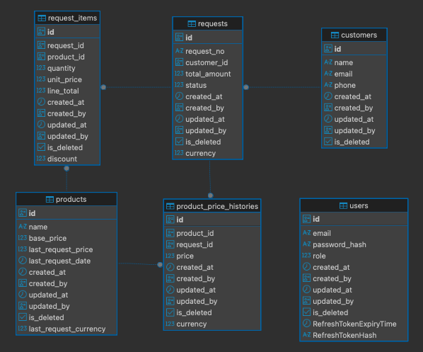

# Smart Quotation & Pricing Engine

*Read this in [Türkçe](README.tr.md)*

This project is a quotation management simulation developed for hardware products (HMI, Led Panel, LCD). The system allows users to select products and get quotations from a Next.js interface; while administrators (Admin) price these requests via an Excel file and send them to the customer. When a quotation is sent, the last price and date information of the products are automatically updated and stored as history.

## 🔗 GitHub Link
**Repository:** [https://github.com/the-atasoy/PTN-SmartQuotationPricingEngine](#)

---

## 🚀 Technologies Used

- **Frontend:** Next.js (App Router), Tailwind CSS, TypeScript, `next-intl` (Multi-language support)
- **Backend:** .NET 10, Entity Framework Core (Code-First), MediatR (CQRS Pattern)
- **Database:** PostgreSQL 16
- **Other Tools:** Docker & Docker Compose, Mailpit (Local SMTP Server), EPPlus (Excel Operations)

---

## ⚙️ Installation Steps and Run Commands

The easiest way to run the project is using **Docker Compose**.

### Option 1: Using Docker Compose (Recommended)

Docker and Docker Compose must be installed on your system.

1. Open a terminal in the root directory of the project.
2. Run the following command to start all services (PostgreSQL, Mailpit, Backend API, Frontend):
   ```bash
   docker-compose up --build
   ```
3. Once the application is up, database migrations and sample data (Seed Data) will be created **automatically**.

**Access Addresses:**
- **Frontend UI:** http://localhost:3000
- **Backend API:** http://localhost:5100
- **PostgreSQL:** localhost:5432
- **Mailpit Web UI (To View Emails):** http://localhost:8025

### Option 2: Running in Local Development Environment (Manual)

If you want to run the project in a development environment without Docker:

1. **Start Infrastructure Services (DB and Mail only):**
   ```bash
   docker-compose up postgres mailpit
   ```
2. **Start Backend API:**
   ```bash
   cd backend
   dotnet restore
   dotnet run --project src/API
   ```
   *(Backend will run at `http://localhost:5100`. Database tables and sample data are automatically populated on the first run.)*

3. **Start Frontend:**
   ```bash
   cd frontend
   npm install
   npm run dev
   ```
   *(Frontend will run at `http://localhost:3000`.)*

### 🔑 Default User Credentials (Seed Data)

The following users are created automatically when the database is initialized:

| Role | Email | Password |
|---|---|---|
| **Admin** | admin@piton.com.tr | Admin123! |
| **User** | user@piton.com.tr | User123! |

---

## 🗄️ Database Structure (PostgreSQL)



The project is developed using the **Code-First** approach. Table and column naming conventions are followed, and they are reflected in the database in `snake_case` format. Relationships between tables are secured with Foreign Key (`FK`) constraints.

A **BaseEntity** structure containing `id` (PK, UUID), `created_at`, `created_by`, `updated_at`, `updated_by`, and `is_deleted` columns is used in all tables (Soft Delete logic applies).

Main tables and their roles are as follows:

### 1. `products`
The table where hardware products (HMI, Led Panel, LCD) are defined.
- **Critical Columns:** `last_request_price` (Last quoted price) and `last_request_date` (Last quote date) are kept here. When a quotation is sent, it is **instantly updated** by the system.
- **Columns:** `id`, `name`, `base_price`, `last_request_price`, `last_request_currency`, `last_request_date`, `... (base fields)`

### 2. `requests`
The table where the header information of the quotation is stored.
- **Columns:** `id`, `request_no` (e.g. RQ-20250515-001), `customer_id` (FK), `total_amount`, `currency`, `status` (0: Pending, 1: Sent, 2: Canceled).

### 3. `request_items`
The detail table where the product lines (line items) belonging to the quotation are kept. Each line is linked to the relevant quotation (`request_id`) and product (`product_id`).
- **Columns:** `id`, `request_id` (FK), `product_id` (FK), `quantity` (Quantity), `unit_price` (Unit Price), `discount` (Discount Amount), `line_total` (Line Total).

### 4. `customers`
The table where customer or account information given a quotation is stored independently of products and requests.
- **Columns:** `id`, `name`, `email`, `phone`.

### 5. `product_price_histories`
Used to log (track) past quotation movements and price changes of products. It is triggered the moment the quotation is sent, and a new record is inserted into this table.
- **Columns:** `id`, `product_id` (FK), `request_id` (FK), `price` (Unit price at that moment), `currency`.

### 6. `users`
The table where authorized (Admin) and normal (User) users who log in to the system are stored. Passwords are kept hashed with the BCrypt algorithm.
- **Columns:** `id`, `email`, `password_hash`, `role`.

### 🔍 Database Indexes
To improve performance and ensure data integrity, the following indexes are created in the database:
- **`requests`:**
  - `request_no` (Unique Index, with `is_deleted = false` filter)
  - `status` (For fast filtering by status)
  - `created_at` (For sorting and date-based queries)
- **`customers`:**
  - `email` (Unique Index, with `is_deleted = false` filter)
- **`users`:**
  - `email` (Unique Index, with `is_deleted = false` filter)
- **`product_price_histories`:**
  - `product_id` and `created_at` (Composite Index - to quickly list the price history of the product)

---

## 🔄 CI/CD Flow

Separate CI workflows are prepared for Frontend and Backend using GitHub Actions. Thanks to the files under the `.github/workflows/` directory, on every push:
1. Docker images are built.
2. (For Frontend) Lint checks and prod build operations are verified inside the container.
3. The stability of the architectural structure (prod vs dev) is ensured.
