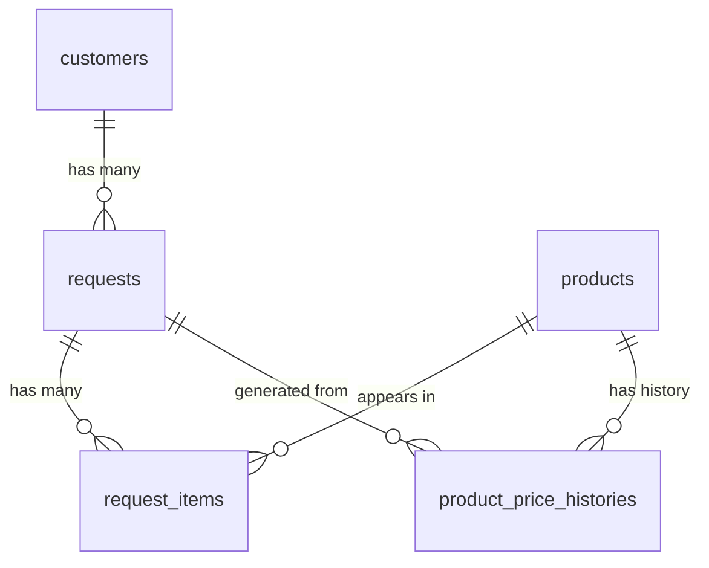

# Backend — Database Schema & Seed Data

## Schema Overview

All table and column names use `snake_case`. Relations use foreign keys. Primary keys are `uuid` (`Guid` in C#).

---

## Tables

### `users`
| Column | Type | Notes |
|---|---|---|
| id | uuid | PK |
| email | varchar(255) | unique |
| password_hash | varchar(512) | BCrypt |
| role | varchar(20) | `User` \| `Admin` |
| created_at | timestamptz | |

### `customers`
| Column | Type | Notes |
|---|---|---|
| id | uuid | PK |
| name | varchar(255) | |
| email | varchar(255) | |
| phone | varchar(50) | nullable |
| created_at | timestamptz | |

### `products`
| Column | Type | Notes |
|---|---|---|
| id | uuid | PK |
| name | varchar(255) | |
| category | varchar(50) | `HMI` \| `LedPanel` \| `LCD` |
| base_price | numeric(18,2) | |
| last_request_price | numeric(18,2) | nullable — updated on every send |
| last_request_date | timestamptz | nullable — updated on every send |
| created_at | timestamptz | |

### `requests`
| Column | Type | Notes |
|---|---|---|
| id | uuid | PK |
| request_no | varchar(50) | unique, auto-generated (e.g. `RQ-20250527-001`) |
| customer_id | uuid | FK → customers |
| total_amount | numeric(18,2) | |
| currency | varchar(10) | `TRY` \| `USD` \| `EUR` |
| status | varchar(20) | `Pending` \| `Sent` \| `Cancelled` |
| created_at | timestamptz | |
| sent_at | timestamptz | nullable |

### `request_items`
| Column | Type | Notes |
|---|---|---|
| id | uuid | PK |
| request_id | uuid | FK → requests |
| product_id | uuid | FK → products |
| quantity | int | |
| unit_price | numeric(18,2) | |
| discount | numeric(5,2) | percentage, default 0 |
| line_total | numeric(18,2) | computed: `quantity * unit_price * (1 - discount/100)` |

### `product_price_histories`
| Column | Type | Notes |
|---|---|---|
| id | uuid | PK |
| product_id | uuid | FK → products |
| request_id | uuid | FK → requests |
| quoted_price | numeric(18,2) | |
| created_at | timestamptz | |

---

## Entity Relationships

---

## Seed Data

Applied at startup via `DataSeeder.cs` (runs only if tables are empty — idempotent).

### Users
- `admin@piton.com.tr` / `Admin123!` — role: `Admin`
- `user@piton.com.tr` / `User123!` — role: `User`

### Customers
3 Turkish company names with real-format emails.

### Products
2× HMI, 2× Led Panel, 2× LCD — each with a `base_price`. 4 of them have pre-populated `last_request_price` and `last_request_date` to make the admin panel non-empty on first run.

### Product Price Histories
6 rows linked to the pre-seeded products.
